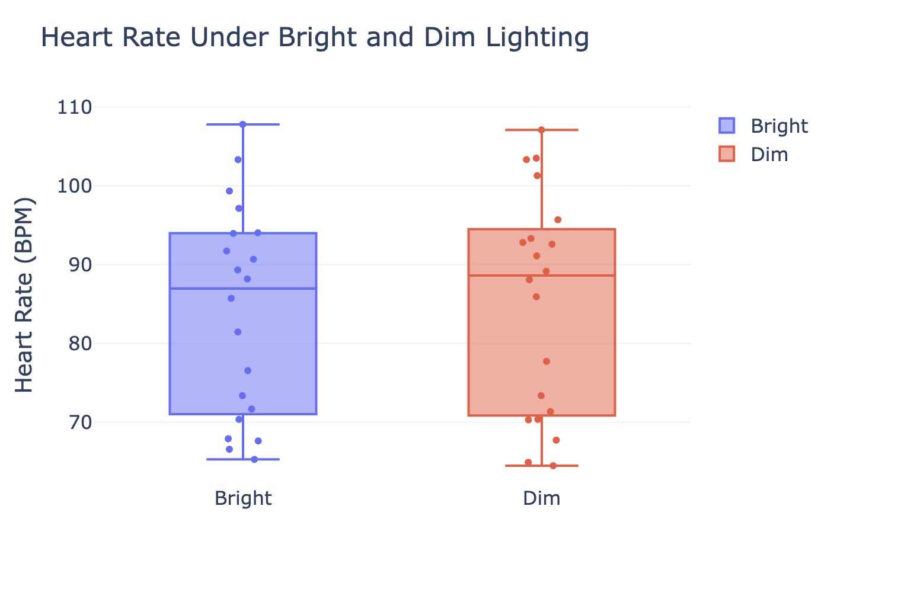
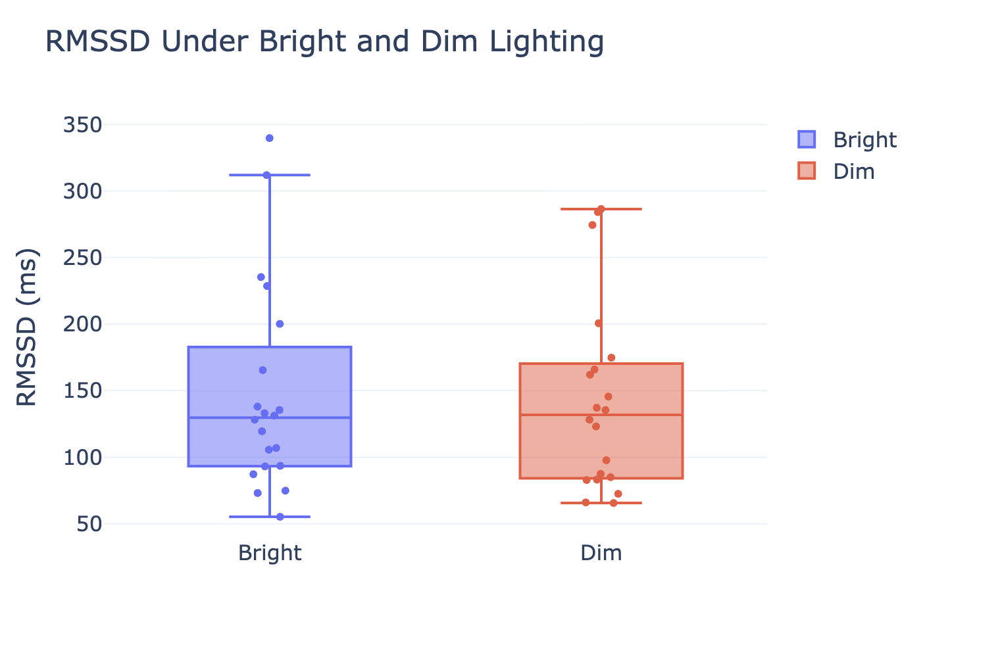
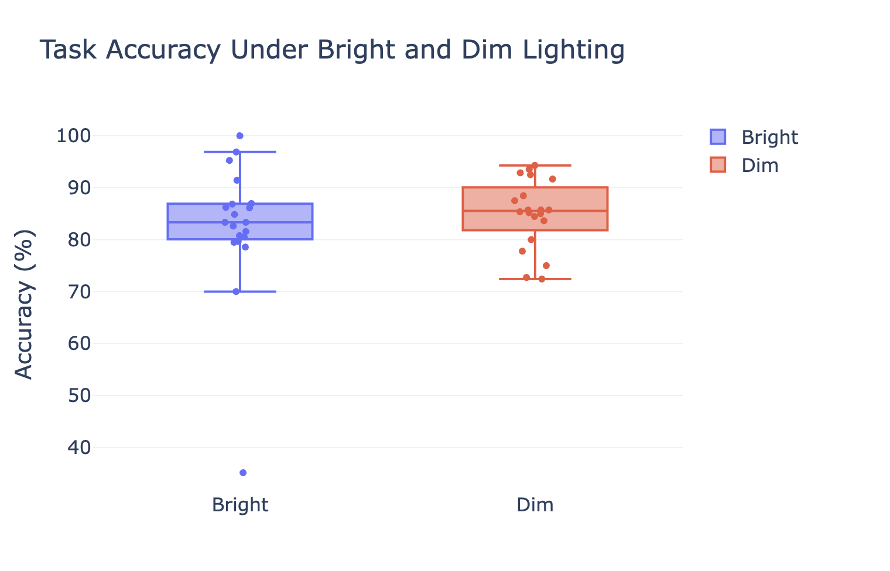
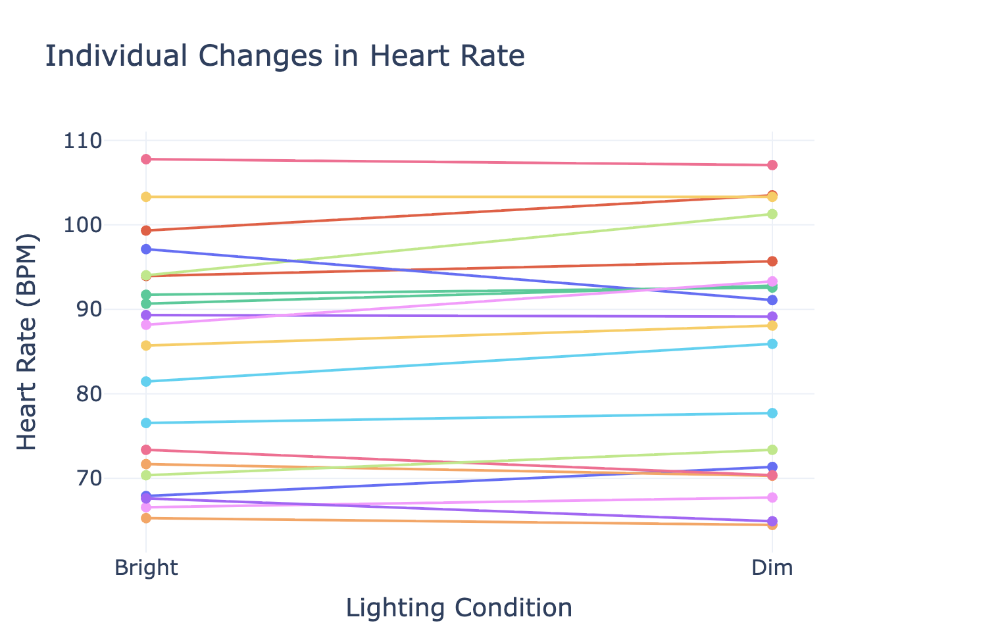
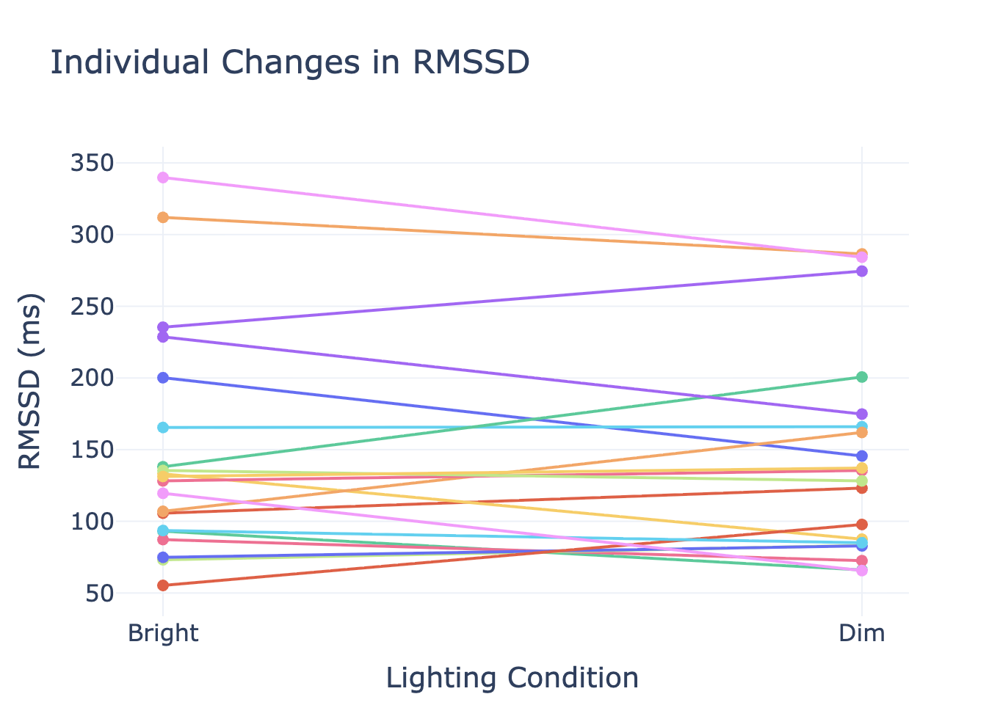
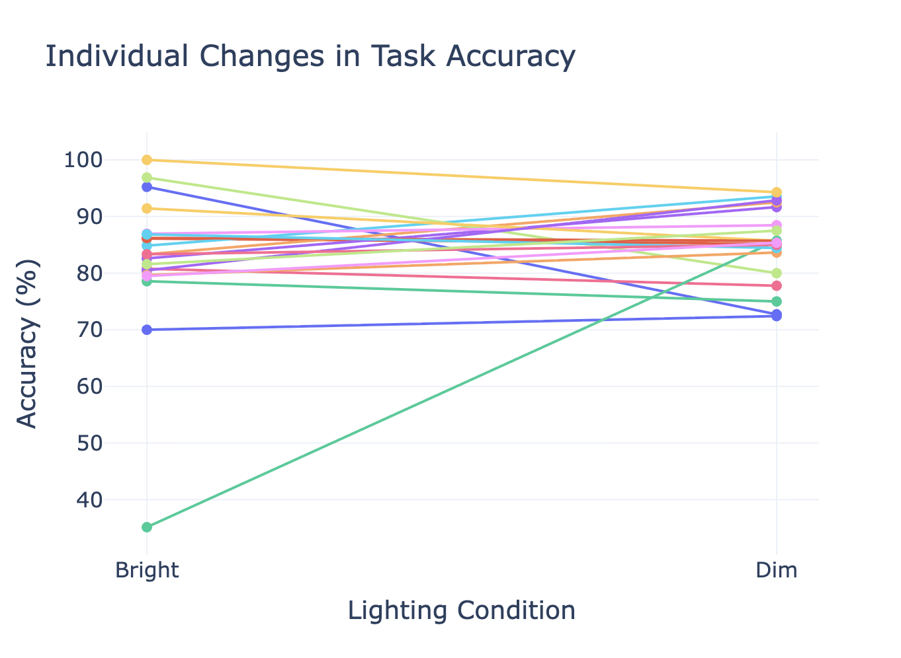

# 🧠 The Effect of Ambient Lighting on Cognitive Performance and Heart Rate Variability


A **Physiological Computing** mini research project investigating the effect of **ambient lighting** on **heart rate (HR)**, **heart rate variability (RMSSD)**, and **cognitive task performance** during a mental arithmetic task using **ECG recordings** from a Polar H10 sensor.

---

# 📌 Project Overview

Ambient lighting is an important environmental factor that may influence attention, alertness, mental workload, and physiological responses. Although previous studies have investigated lighting and cognitive performance, fewer have examined its simultaneous effects on **autonomic nervous system activity** and **objective task performance**.

This project investigates whether **bright** and **dim** lighting conditions produce measurable differences in:

- ❤️ Heart Rate (HR)
- 💓 Heart Rate Variability (RMSSD)
- 🧠 Arithmetic Task Accuracy

ECG signals were recorded continuously during mental arithmetic tasks and analysed using Python.

---

# ❓ Research Question

> **How does ambient lighting influence heart rate (HR), heart rate variability (RMSSD), and cognitive task performance during a mental arithmetic task?**

---

# 🔬 Experimental Design

### Participants

- 20 healthy university students
- Within-subject experimental design
- Every participant completed both lighting conditions

### Lighting Conditions

- 💡 Bright Lighting
- 🌙 Dim Lighting

The order of conditions was **counterbalanced** to minimise order effects.

---

# ⚙️ Experimental Workflow

```text
Participant

      │

      ▼

2-minute Baseline ECG

      │

      ▼

5-minute Mental Arithmetic
(Bright or Dim)

      │

      ▼

2-minute Recovery

      │

      ▼

5-minute Mental Arithmetic
(Other Lighting)

      │

      ▼

ECG Signal Processing

      │

      ▼

Statistical Analysis

      │

      ▼

Results & Visualisation
```

---

# ❤️ Physiological Measures

ECG signals were processed using **NeuroKit2** to obtain:

- Heart Rate (HR)
- Heart Rate Variability (RMSSD)

Task performance was evaluated using:

- Number of attempted questions
- Number of correct answers
- Task Accuracy (%)

---

# 📊 Statistical Analysis

The following analyses were performed:

- Descriptive Statistics
- Shapiro–Wilk Normality Test
- Paired Sample t-test
- Wilcoxon Signed-Rank Test
- Cohen's d Effect Size
- 95% Confidence Intervals

Significance level:

```
α = 0.05
```

---

# 💻 Technologies Used

- Python
- Pandas
- NumPy
- SciPy
- NeuroKit2
- Plotly
- Polar H10 ECG Sensor

---

# 📁 Repository Structure

```text
ambient-lighting-physiological-computing/

│
├── CODE/
│   ├── analysis_data.py
│   ├── group_analysis.py
│   ├── plotting.py
│   └── statistical_analysis.py
│
├── Raw data/
│   ├── ECG recordings
│
├── Processed data/
│   ├── Participant results
│   ├── master_dataset.csv
│   └── master_statistics.csv
│
├── Figures/
│   ├── HR_Boxplot.png
│   ├── RMSSD_Boxplot.png
│   ├── Accuracy_Boxplot.png
│   ├── HR_Paired.png
│   ├── RMSSD_Paired.png
│   └── Accuracy_Paired.png
│
├── Report_Group_S.pdf
├── README.md
├── requirements.txt
└── LICENSE
```

---

# 📈 Statistical Summary

| Variable | Bright Mean | Dim Mean | Statistical Test | p-value | Effect Size |
|-----------|------------:|----------:|-----------------|---------:|------------:|
| Heart Rate | 84.10 BPM | 85.20 BPM | Paired t-test | 0.130 | -0.35 |
| RMSSD | 147.85 ms | 142.94 ms | Paired t-test | 0.560 | 0.13 |
| Task Accuracy | 82.47% | 84.98% | Wilcoxon Signed-Rank | 0.388 | -0.18 |

---

# 📊 Results

## ❤️ Heart Rate



**Finding**

- Mean Bright = **84.10 BPM**
- Mean Dim = **85.20 BPM**
- Paired t-test:
  - *t*(19) = -1.58
  - *p* = 0.130
- Cohen's *d* = -0.35

No statistically significant difference was observed.

---

## 💓 Heart Rate Variability (RMSSD)



**Finding**

- Mean Bright = **147.85 ms**
- Mean Dim = **142.94 ms**
- Paired t-test:
  - *t*(19) = 0.59
  - *p* = 0.560
- Cohen's *d* = 0.13

No statistically significant difference was observed.

---

## 🧠 Cognitive Performance



Task accuracy violated the normality assumption and was analysed using the **Wilcoxon Signed-Rank Test**.

**Finding**

- Mean Bright = **82.47%**
- Mean Dim = **84.98%**
- W = 81
- *p* = 0.388

No statistically significant difference was observed.

---

# 👥 Individual Participant Responses

## Heart Rate



---

## RMSSD



---

## Task Accuracy



The paired plots illustrate substantial inter-individual variability, with no consistent trend favouring either lighting condition.

---

# ✅ Key Findings

- Twenty participants completed both lighting conditions.
- No statistically significant difference was observed in Heart Rate.
- No statistically significant difference was observed in RMSSD.
- No statistically significant difference was observed in arithmetic task accuracy.
- Ambient lighting produced only small physiological changes under the experimental conditions.
- Effect sizes were small for all dependent variables.

---

# 🚀 How to Run

## Clone the repository

```bash
git clone https://github.com/YOUR_USERNAME/ambient-lighting-physiological-computing.git
```

---

## Install dependencies

```bash
pip install -r requirements.txt
```

---

## Run participant analysis

```bash
python CODE/analysis_data.py
```

---

## Run statistical analysis

```bash
python CODE/statistical_analysis.py
```

---

## Generate visualisations

```bash
python CODE/plotting.py
```

---

# 📄 Research Report

The complete research report describing the study background, methodology, ECG signal processing, statistical analysis, visualizations, discussion, limitations, and conclusions is included in this repository.

**Research Paper**

📄 `Report_Group_S (1).pdf`

---

# 🔮 Future Work

Future research could improve this study by:

- Increasing the sample size.
- Including additional lighting levels and colour temperatures.
- Extending exposure duration.
- Recording subjective workload and perceived comfort.
- Including additional HRV metrics such as SDNN and LF/HF ratio.
- Combining ECG with eye tracking or pupillometry.

---

# 👨‍💻 Authors

- **Suresh Raj Joshi**
- Kamal Kumar
- Ahmad Zia
- Arya Dey
- Shaban Rahim

**Course:** Physiological Computing

**Institution:** Bauhaus-Universität Weimar

**Year:** 2026

---

# 📚 References

The complete list of academic references used in this project is available in the accompanying research report (`Report_Group_S.pdf`).

Key software libraries include:

- NeuroKit2
- SciPy
- Pandas
- Plotly

---

# 📜 License

This project is licensed under the **MIT License**.

---

## ⭐ If you found this repository useful, consider giving it a star!
